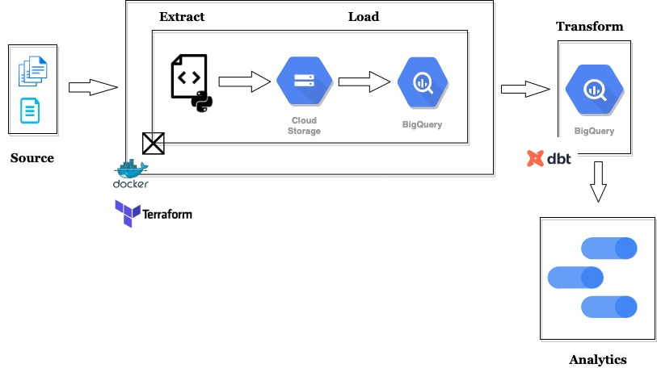

Table of Contents
- [About the Project](#about-the-project)
  - [Flights Delay Analysis](#flights-delay-analysis)
  - [Architecture Diagram](#architecture-diagram)
  - [Technologies Used](#technologies-used)
  - [Dashboard](#dashboard)

# About the Project

## Flights Delay Analysis

The importance of the modern aviation industry is difficult to overstate. One of the main reasons for this is the globalised nature of the industry. Global aviation has been key in facilitating efficient travel to distant places. It has also been a key contributor to global economic prosperity - by facilitating both trade and tourism.

> A flight delay is when an airline flight takes off and/or lands later than its scheduled time. The Federal Aviation Administration (FAA) considers a flight to be delayed when it is 15 minutes later than its scheduled time. A cancellation occurs when the airline does not operate the flight at all for a certain reason. - [Wikipedia](https://en.wikipedia.org/wiki/Flight_cancellation_and_delay)

The Aim of this project is to create an Extract, Load, Transform (ELT) Pipeline to help analyze the Flights Delay and Cancellation Data. The analysis would mainly be in the direction of finding some spatial or temporal factors that might affect flight delays and cancellation. 

## Architecture Diagram

## Technologies Used

* 
* 
* 
* 
* 
* 

## Dashboard

Link to the Dashboard - [Flight Delay Analysis](https://datastudio.google.com/reporting/b6963f3b-5bca-4e56-bc90-1b5988097372)