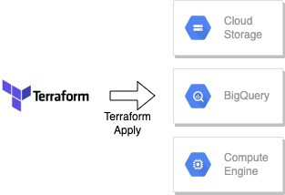

## Terraform - Infrastructure



Steps : 

1. Create a new GCP Project
2. Setup Service Account and Authentication and Download the service-account-keys for authentication
3. Setup the required IAM Roles and enable the following APIs
    - https://console.cloud.google.com/apis/library/iam.googleapis.com
    - https://console.cloud.google.com/apis/library/iamcredentials.googleapis.com
4. Launch a smallish Compute Engine VM (Launched E2-Medium for my use cases)
5. Install Terraform in the server
   - https://www.terraform.io/downloads
6. Upload the GCP service account keys and set the path to the keys as the environment variable
```bash
export GOOGLE_APPLICATION_CREDENTIALS="<path/to/your/service-account-authkeys>.json"
```
7. Clone the reporsitory and type
```bash
cd infrastructure
```
8. Run the following commands to launch a Compute Server for running the ingestion part, setup BigQuery as our Data Warehouse and Google Cloud Storage as our Data Lake. 
```bash
# authentication
gcloud auth activate-service-account --key-file $GOOGLE_APPLICATION_CREDENTIALS

# initialize terraform
terraform init

# check changes to the infrastructure plan and pass the required input variables
terraform plan -var="project=<your-gcp-project-id>" -var="ssh_pub_key_file=<path-to-ssh-key>" -var="startup_script_location=<path-to-startup-script>"

# create the infrastructure
terraform apply -var="project=<your-gcp-project-id>" -var="ssh_pub_key_file=<path-to-ssh-key>" -var="startup_script_location=<path-to-startup-script>"
```

9. Once the new infrastructure is up, we can stop this instance. In case we need to set up new instances, we can use this server as the source of spinning everything up.