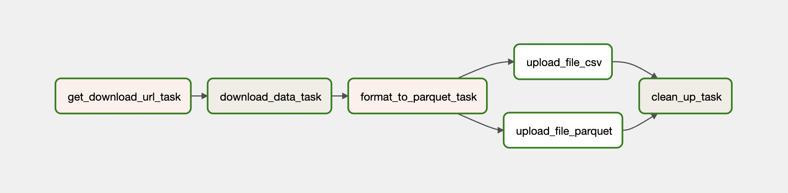
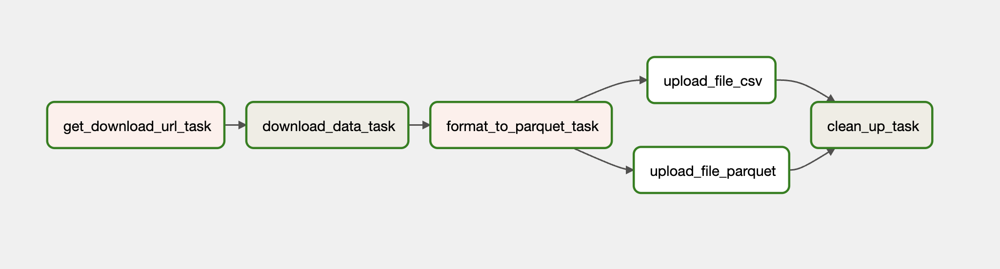
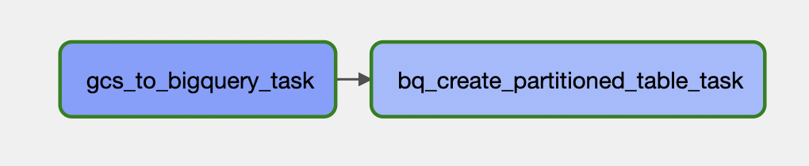

# Airflow - Ingestion

1. The server started using terraform already has docker and docker-compose installed as part of the startup script. 
2. Clone the repository and cd into the ingestion directory
3. Build and start the airflow services
```bash
# build the image
docker-compose build

# initialize the Airflow scheduler, DB, and other config
docker-compose up airflow-init

# start all services
docker-compose up --detach
```
4. Login to the airflow webserver on localhost:8080 with the credentials used in the airflow.env file
5. Run the DAGs
6. Stop the instance once all the DAGs have executed successfully.


# DAGs

## Flights DAG
Downloads the Yearly csv file of Flight Delays and Cancellations, converts it into parquet format and uploads to GCS.



## Miscellaneous Files Dag
Downloads the supporting csv files (like carrier info, airport info), converts it into parquet format and uploads to GCS.



## Flights GCS to BQ Dag
Dag that ingests the data from the data lake - GCS to the Data Warehouse - BigQuery

